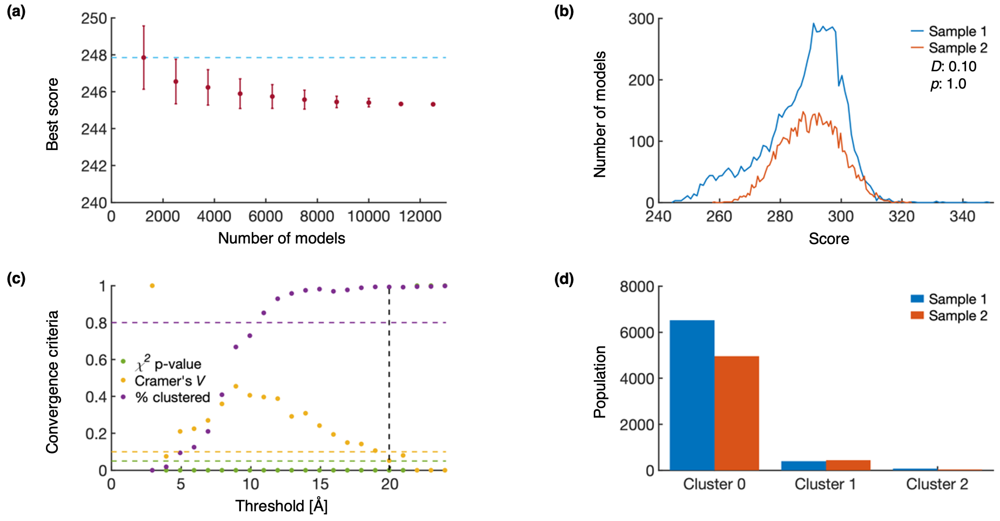

IMP spatiotemporal tutorial {#notebook}
========

# Introduction {#notebook_introduction}

Biomolecules are constantly in motion; therefore, a complete depiction of their function must include their dynamics instead of just static structures. We have developed an integrative spatiotemporal approach to model dynamic systems.

Our approach applies a composite workflow, consisting of three modeling problems to compute (i) heterogeneity models, (ii) snapshot models, and (iii) trajectory models.
Heterogeneity models describe the possible biomolecular compositions of the system at each time point. Optionally, other auxiliary variables can be considered, such as the coarse location in the final state when modeling an assembly process.
For each heterogeneity model, one snapshot model is produced. A snapshot model is a set of alternative standard static integrative structure models based on the information available for the corresponding time point.
Then, trajectory models are created by connecting alternative snapshot models at adjacent time points. These trajectory models can be scored based on both the scores of static structures and the transitions between them, allowing for the creation of trajectories that are in agreement with the input information by construction.

If you use this tutorial or its accompanying method, please site the corresponding publications:

- Latham, A.P.; Tempkin, J.O.B.; Otsuka, S.; Zhang, W.; Ellenberg, J.; Sali, A. bioRxiv, 2024, https://doi.org/10.1101/2024.08.06.606842.
- Latham, A.P.; Rožič, M.; Webb, B.M., Sali, A. in preparation. (tutorial)

# Integrative spatiotemporal modeling workflow {#notebook_steps}

In general, integrative modeling proceeds through three steps (i. gathering information; ii. choosing the model representation, scoring alternative models, and searching for good scoring models; and iii. assessing the models). In integrative spatiotemporal modeling, these three steps are repeated for each modeling problem in the composite workflow (i. modeling of heterogeneity, ii. modeling of snapshots, and iii. modeling of a trajectory).

This tutorial will walk you through the creation of a spatiotemporal model for the  hypothetical assembly mechanism of the Bmi1/Ring1b-UbcH5c complex. We note that all experimental data besides the static structure used in this study is purely hypothetical, and, thus, the model should not be interpreted to be meaningful about the actual assembly mechanism of the complex.

Finally, this notebook is intended to present an abbreviated version of this protocol, with the computationally expensive steps excluded. A more complete version of this tutorial can be found as a series of python scripts at https://github.com/salilab/imp_spatiotemporal_tutorial.

Modeling of heterogeneity {#notebook_heterogeneity}
====================================

Here, we describe the first modeling problem in our composite workflow, how to build models of heterogeneity modeling using IMP. In this tutorial, heterogeneity modeling only includes protein copy number; however, in general, other types of information, such as the coarse location in the final state, could also be included in heterogeneity models.

# Heterogeneity modeling step 1: gathering of information {#notebook_heterogeneity1}

We begin heterogeneity modeling with the first step of integrative modeling, gathering information. Heterogeneity modeling will rely on copy number information about the complex. In this case, we utilize the X-ray crystal structure of the fully assembled Bmi1/Ring1b-UbcH5c complex from the protein data bank (PDB), and synthetically generated protein copy numbers during the assembly process, which could be generated from experiments such as flourescence correlation spectroscopy (FCS).

The PDB structure of the complex informs the final state of our model and constrains the maximum copy number for each protein, while the protein copy number data gives time-dependent information about the protein copy number in the assembling complex.

# Heterogeneity modeling step 2: representation, scoring function, and search process {#notebook_heterogeneity2}

Next, we represent, score and search for heterogeneity models models. A single heterogeneity model is a set of protein copy numbers, scored according to its fit to experimental copy number data at that time point. As ET and SAXS data, are only available at 0 minutes, 1 minute, and 2 minutes, we choose to create heterogeneity models at these three time points. We then use `prepare_protein_library`, to calculate the protein copy numbers for each snapshot model and to use the topology file of the full complex (`spatiotemporal_topology.txt`) to generate a topology file for each of these snapshot models. The choices made in this topology file are important for the representation, scoring function, and search process for snapshot models, and are discussed later. For heterogeneity modeling, we choose to model 3 protein copy numbers at each time point, and restrict the final time point to have the same protein copy numbers as the PDB structure.

\code{.py}
# General imports for the tutorial
import sys, os, glob, shutil
from IMP.spatiotemporal import prepare_protein_library
import IMP.spatiotemporal as spatiotemporal
from IMP.spatiotemporal import analysis
import numpy as np
import matplotlib.pyplot as plt
\endcode
\code{.py}
# parameters for prepare_protein_library:
times = ["0min", "1min", "2min"]
exp_comp = {'A': '../../../modeling/Input_Information/gen_FCS/exp_compA.csv',
            'B': '../../../modeling/Input_Information/gen_FCS/exp_compB.csv',
            'C': '../../../modeling/Input_Information/gen_FCS/exp_compC.csv'}
expected_subcomplexes = ['A', 'B', 'C']
template_topology = 'spatiotemporal_topology.txt'
template_dict = {'A': ['Ubi-E2-D3'], 'B': ['BMI-1'], 'C': ['E3-ubi-RING2']}
nmodels = 3

# calling prepare_protein_library
prepare_protein_library.prepare_protein_library(times, exp_comp, expected_subcomplexes, nmodels,
                                                template_topology=template_topology, template_dict=template_dict)
\endcode
From the output of `prepare_protein_library`, we see that there are 3 heterogeneity models at each time point (it is possible to have more snapshot models than copy numbers if multiple copies of the protein exist in the complex). For each heterogeneity model, we see 2 files:
- *.config, a file with a list of proteins represented in the heterogeneity model
- *_topol.txt, a topology file for snapshot modeling corresponding to this heterogeneity model.

# Heterogeneity modeling step 3: assessment {#notebook_heterogeneity_assess}

Now, we have a variety of heterogeneity models. In general, there are four ways to assess a model: estimate the sampling precision, compare the model to data used to construct it, validate the model against data not used to construct it, and quantify the precision of the model. Here, we will focus specifically on comparing the model to experimental data, as other assessments will be performed later, when the trajectory models are assessed.

Next, we can plot the modeled and experimental copy numbers simultaneously for each protein, as shown below for proteins A (a), B (b), and C (c).

From these plots, we observe that the range of possible experimental copy numbers are well sampled by the heterogeneity models, indicating that we are prepared for snapshot modeling.

Modeling of snapshots {#notebook_snapshots}
====================================

Here, we describe the second modeling problem in our composite workflow, how to build models of static snapshot models using IMP. We note that this process is similar to previous tutorials of [actin](https://integrativemodeling.org/tutorials/actin/) and [RNA PolII](https://integrativemodeling.org/tutorials/rnapolii_stalk/).

# Snapshot modeling step 1: gathering of information {#notebook_snapshots1}

We begin snapshot modeling with the first step of integrative modeling, gathering information. Snapshot modeling utilizes structural information about the complex. In this case, we utilize heterogeneity models, the X-ray crystal structure of the fully assembled Bmi1/Ring1b-UbcH5c complex from the protein data bank (PDB), synthetically generated electron tomography (ET) density maps during the assembly process, and physical principles.

The heterogeneity models inform protein copy numbers for the snapshot models. The PDB structure of the complex informs the structure of the individual proteins. The time-dependent ET data informs the size and shape of the assembling complex. physical principles inform connectivity and excluded volume.

# Snapshot modeling step 2: representation, scoring function, and search process {#notebook_snapshots2}

Next, we represent, score and search for snapshot models. This step is quite computationally expensive. Therefore, we will not run the modeling protocol in this notebook, though the scripts are available in `modeling/Snapshots/Snapshots_Modeling/`. Here, we will simply describe the important steps made by two scripts. The first, `static_snapshot.py`, uses IMP to represent, score, and search for a single static snapshot model. The second, `start_sim.py`, automates the creation of a snapshot model for each heterogeneity model.

## Modeling one snapshot {#autotoc1v1}
Here, we will describe the process of modeling a single snapshot model, as performed by running `static_snapshot.py`.

### Representing the model {#notebook_snapshot_representation}

We begin by representing the data and the model. In general, the *representation* of a system is defined by all the variables that need to be determined.

For our model of a protein complex, we use a combination of two representations. The first is a series of *spherical beads*, which can correspond to portions of the biomolecules of interest, such as atoms or groups of atoms. The second is a series of *3D Gaussians*, which help calculate the overlap between our model and the density from ET data.

Beads and Gaussians in our model belong to either a *rigid body* or *flexible string*. The positions of all beads and Gaussians in a single rigid body are constrained during sampling and do not move relative to each other. Meanwhile, flexible beads can move freely during sampling, but are restrained by sequence connectivity.

To begin, we built a topology file with the representation for the model of the complete system, `spatiotemporal_topology.txt`, located in `Heterogeneity/Heterogeneity_Modeling/`. This complete topology was used as a template to build topologies of each heterogeneity model. Based on our observation of the structure of the complex, we chose to represent each protein with at least 2 separate rigid bodies, and left the first 28 residues of protein C as flexible beads. Rigid bodies were described with 1 bead for every residue, and 10 residues per Gaussian. Flexible beads were described with 1 bead for every residue and 1 residue per Gaussian. A more complete description of the options available in topology files is available in the the [TopologyReader](https://integrativemodeling.org/2.21.0/doc/ref/classIMP_1_1pmi_1_1topology_1_1TopologyReader.html) documentation.

\code{.txt}
|molecule_name | color | fasta_fn | fasta_id | pdb_fn | chain | residue_range | pdb_offset | bead_size | em_residues_per_gaussian | rigid_body | super_rigid_body | chain_of_super_rigid_bodies | 

|Ubi-E2-D3|blue|3rpg.fasta.txt|Ubi-E2-D3|3rpg.pdb|A|-1,18|2|1|10|1|1||
|Ubi-E2-D3|blue|3rpg.fasta.txt|Ubi-E2-D3|3rpg.pdb|A|19,147|2|1|10|2|1||
|BMI-1|red|3rpg.fasta.txt|BMI-1|3rpg.pdb|B|3,83|-2|1|10|3|2||
|BMI-1|red|3rpg.fasta.txt|BMI-1|3rpg.pdb|B|84,101|-2|1|10|4|2||
|E3-ubi-RING2|green|3rpg.fasta.txt|E3-ubi-RING2|BEADS|C|16,44|-15|1|1|5|3||
|E3-ubi-RING2|green|3rpg.fasta.txt|E3-ubi-RING2|3rpg.pdb|C|45,116|-15|1|10|6|3||
\endcode

Next, we must prepare `static_snapshot.py` to read in this topology file. We begin by defining the input variables, `state` and `time`, which define which topology to use, as well as the paths to other pieces of input information.

\code{.py}
### Running parameters to access correct path of ET_data for EM restraint {#autotoc1v2}### and topology file for certain {state}_{time}_topol.txt {#autotoc1v3}state = sys.argv[1]
time = sys.argv[2]

### Topology file {#autotoc1v4}topology_file = f"../{state}_{time}_topol.txt"
### Paths to input data for topology file {#autotoc1v5}pdb_dir = "../../../../Input_Information/PDB"
fasta_dir = "../../../../Input_Information/FASTA"
### Path where forward gmms are created with BuildSystem (based ont topology file) {#autotoc1v6}### If gmms exist, they will be used from this folder {#autotoc1v7}forward_gmm_dir = "../forward_densities/"
### Path to experimental gmms {#autotoc1v8}exp_gmm_dir= '../../../../Input_Information/ET_data/add_noise'
\endcode

Next, we build the system, using the topology tile, described above.
\code{.py}
### Create a system from a topology file. Resolution is set on 1. {#autotoc1v9}bs = IMP.pmi.macros.BuildSystem(mdl, resolutions= 1, name= f'Static_snapshots_{state}_{time}')
bs.add_state(t)
\endcode

Then, we prepare for later sampling steps by setting which Monte Carlo moves will be performed. Rotation (`rot`) and translation (`trans`) parameters are separately set for super rigid bodies (`srb`), rigid bodies (`rb`), and beads (`bead`).
\code{.py}
### Macro execution: It gives hierarchy and degrees of freedom (dof). {#autotoc1v10}### In dof we define how much can each (super) rigid body translate and rotate between two adjacent Monte Carlo steps {#autotoc1v11}root_hier, dof = bs.execute_macro(max_rb_trans=1.0,
                                  max_rb_rot=0.5, max_bead_trans=2.0,
                                  max_srb_trans=1.0, max_srb_rot=0.5)
\endcode

### Scoring the model {#notebook_snapshot_scoring}

After building the model representation, we choose a scoring function to score the model based on input information. This scoring function is represented as a series of restraints that serve as priors.

#### Connectivity {#autotoc1v12}
We begin with a connectivity restraint, which restrains beads adjacent in sequence to be close in 3D space.

\code{.py}
#### Adding Restraints {#autotoc1v13}#### Empty list where the data from restraints should be collected {#autotoc1v14}output_objects=[]

#### Two common restraints: ConnectivityRestraint and ExcludedVolumeSphere {#autotoc1v15}#### ConnectivityRestraint is added for each "molecule" separately {#autotoc1v16}for m in root_hier.get_children()[0].get_children():
    cr = IMP.pmi.restraints.stereochemistry.ConnectivityRestraint(m)
    cr.add_to_model()
    output_objects.append(cr)
\endcode

#### Excluded volume {#autotoc1v17}
Next is an excluded volume restraint, which restrains beads to minimize their spatial overlap.

\code{.py}
#### Add excluded volume {#autotoc1v18}evr = IMP.pmi.restraints.stereochemistry.ExcludedVolumeSphere(
                                     included_objects=[root_hier],
                                     resolution=1000)
output_objects.append(evr)
evr.add_to_model()
\endcode

#### Electron tomography {#autotoc1v19}
Finally, we restrain our models based on their fit to ET density maps. Both the experimental map and the forward protein density are represented as Gaussian mixture models (GMMs) to speed up scoring. The score is based on the log of the correlation coefficient between the experimental density and the forward protein density.

\code{.py}
#### Applying time-dependent EM restraint. Point to correct gmm / mrc file at each time point {#autotoc1v20}#### Path to corresponding .gmm file (and .mrc file) {#autotoc1v21}em_map = exp_gmm_dir + f"/{time}_noisy.gmm"

#### Create artificial densities from hierarchy {#autotoc1v22}densities = IMP.atom.Selection(root_hier,
                 representation_type=IMP.atom.DENSITIES).get_selected_particles()

#### Create EM restraint based on these densities {#autotoc1v23}emr = IMP.pmi.restraints.em.GaussianEMRestraint(
        densities,
        target_fn=em_map,
        slope=0.000001,
        scale_target_to_mass=True,
        weight=1000)
output_objects.append(emr)
emr.add_to_model()
\endcode

### Searching for good scoring models {#notebook_snapshot_searching}

After building a scoring function that scores alternative models based on their fit to the input information, we aim to search for good scoring models. For complicated systems, stochastic sampling techniques such as Monte Carlo (MC) sampling are often the most efficient way to compute good scoring models. Here, we generate a random initial configuration and then perform temperature replica exchange MC sampling with 16 temperatures from different initial configurations. By performing multiple runs of replica exchange MC from different initial configurations, we can later ensure that our sampling is sufficiently converged.

\code{.py}
### Generate random configuration {#autotoc1v24}IMP.pmi.tools.shuffle_configuration(root_hier,
                                    max_translation=50)

### Perform replica exchange sampling {#autotoc1v25}rex=IMP.pmi.macros.ReplicaExchange(mdl,
        root_hier=root_hier,
        monte_carlo_sample_objects=dof.get_movers(),
        global_output_directory='output', # name 'output' is the best for imp sampcon select_good
        output_objects=output_objects,
        monte_carlo_steps=200, # Number of MC steps between writing frames.
        number_of_best_scoring_models=0,
        number_of_frames=500) # number of frames to be saved
### In our case, for each snapshot we generated 25000 frames altogether (50*500) {#autotoc1v26}rex.execute_macro()
\endcode

After performing sampling, a variety of outputs will be created. These outputs include `.rmf` files, which contain multi-resolution models output by IMP, and `.out` files which contains a variety of information about the run such as the value of the restraints and the MC acceptance rate.

## Generalizing modeling to all snapshots {#notebook_snapshot_combine}

Next, we will describe the process of computing multiple static snapshot models, as performed by running `start_sim.py`.

From heterogeneity modeling, we see that there are 3 heterogeneity models at each time point (it is possible to have more snapshot models than copy numbers if multiple copies of the protein exist in the complex), each of which has a corresponding topology file in `Heterogeneity/Heterogeneity_Modeling/`. We wrote a function, `generate_all_snapshots`, which creates a directory for each snapshot model, copies the python script and topology file into that directory, and submits a job script to run sampling. The job script will likely need to be customized for the user's computer or cluster.

\code{.py}
## 1a - parameters for generate_all_snapshots {#autotoc1v27}## state_dict - universal parameter {#autotoc1v28}state_dict = {'0min': 3, '1min': 3, '2min': 1}

main_dir = os.getcwd()
topol_dir = os.path.join(os.getcwd(), '../../Heterogeneity/Heterogeneity_Modeling')
items_to_copy = ['static_snapshot.py']  # additionally we need to copy only specific topology file
## jobs script will likely depend on the user's cluster / configuration {#autotoc1v29}job_template = ("#!/bin/bash\n#$ -S /bin/bash\n#$ -cwd\n#$ -r n\n#$ -j y\n#$ -N Tutorial\n#$ -pe smp 16\n"
                "#$ -l h_rt=48:00:00\n\nmodule load Sali\nmodule load imp\nmodule load mpi/openmpi-x86_64\n\n"
                "mpirun -np $NSLOTS python3 static_snapshot.py {state} {time}")
number_of_runs = 50

## 1b - calling generate_all_snapshots {#autotoc1v30}generate_all_snapshots(state_dict, main_dir, topol_dir, items_to_copy, job_template, number_of_runs)

\endcode

# Snapshot modeling step 3: assessment {#notebook_snapshot_assess}

The above code would variety of alternative snapshot models. In general, we would like to assess these models in at least 4 ways: estimate the sampling precision, compare the model to data used to construct it, validate the model against data not used to construct it, and quantify the precision of the model. In this portion of the tutorial, we focus specifically on estimating the sampling precision of the model, while quantitative comparisons between the model and experimental data will be reserved for the final step, when we assess trajectories. Again, this assessment process is quite computationally intensive, so, instead of running the script explicitly, we will walk you through the `snapshot_assessment.py` script, which is located in the `modeling/Snapshots/Snapshots_Assessment` folder.

## Filtering good scoring models {#notebook_snapshot_filter}

Initially, we want to filter the various alternative structural models to only select those that meet certain parameter thresholds. In this case, we filter the structural models comprising each snapshot model by the median cross correlation with EM data. We note that this filtering criteria is subjective, and developing a Bayesian method to objectively weigh different restraints for filtering remains an interesting future development in integrative modeling.

The current filtering procedure involves three steps. In the first step, we look through the `stat.*.out` files to write out the cross correlation with EM data for each model, which, in this case, is labeled column `3`, `GaussianEMRestraint_None_CCC`. In other applications, the column that corresponds to each type of experimental data may change, depending on the scoring terms for each model. For each snapshot model, a new file is written with this data (`{state}_{time}_stat.txt`).

\code{.py}
## state_dict - universal parameter {#autotoc1v31}state_dict = {'0min': 3, '1min': 3, '2min': 1}
## current directory {#autotoc1v32}main_dir = os.getcwd()

## 1 calling extracting_stat_files function and related parameters {#autotoc1v33}keys_to_extract = [3]
runs_nr = 50
replica_nr = 16
replica_output_name = 'output'
decimals_nr = 16

extracting_stat_files(state_dict, runs_nr, replica_nr, replica_output_name, keys_to_extract, decimals_nr)
print("extracting_stat_files is DONE")
print("")
print("")
\endcode

In the second step, we want to determine the median value of EM cross correlation for each snapshot model. We wrote `general_rule_calculation` to look through the `general_rule_column` for each `{state}_{time}_stat.txt` file and determine both the median value and the number of structures generated.

\code{.py}
## 2 calling general_rule_calculation and related parameters {#autotoc1v34}general_rule_column = '3'

general_rule_calculation(state_dict, general_rule_column)

print("general_rule_calculation is DONE")
print("")
print("")
\endcode

In the third step, we use the `imp_sampcon select_good` tool to filter each snapshot model, according to the median value determined in the previous step. For each snapshot model, this function produces a file, `good_scoring_models/model_ids_scores.txt`, which contains the run, replicaID, scores, and sampleID for each model that passes filtering. It also saves RMF files with each model from two independent groups of sampling runs from each snapshot model to `good_scoring_models/sample_A` and `good_scoring_models/sample_B`, writes the scores for the two independent groups of sampling runs to `good_scoring_models/scoresA.txt` and `good_scoring_models/scoresB.txt`, and writes `good_scoring_models/model_sample_ids.txt` to connect each model to its division of sampling run. More information on `imp_sampcon` is available in the analysis portion of the [actin tutorial](https://integrativemodeling.org/tutorials/actin/analysis.html).

\code{.py}
## 3 calling general_rule_filter_independent_samples {#autotoc1v35}general_rule_filter_independent_samples(state_dict, main_dir)
print("general_rule_filter_independent_samples is DONE")
print("")
print("")
\endcode

## Plotting data, clustering models, and determining sampling precision {#notebook_snapshot_sampling_precision}

Next, scores can be plotted for analysis. Here, we wrote the `create_histograms` function to run `imp_sampcon plot_score` so that it plots distributions for various scores of interest. Each of these plots are saved to `histograms{state}_{time}/{score}.png`, where score is an object listed in the `score_list`. These plots are useful for debugging the modeling protocol, and should appear roughly Gaussian.

\code{.py}
## 4 calling create_histograms and related parameters {#autotoc1v36}score_list = [
    'Total_Score',
    'ConnectivityRestraint_Score',
    'ExcludedVolumeSphere_Score',
    'GaussianEMRestraint_None',
    'GaussianEMRestraint_None_CCC'
] # list of histograms we want to create in each histograms{state}_{time} directory

create_histograms(state_dict, main_dir, score_list)
print("create_histograms is DONE")
print("")
print("")
\endcode

We then check the number of models in each sampling run though our function, `count_rows_and_generate_report`, which writes the `independent_samples_stat.txt` file. Empirically, we have found that ensuring the overall number of models in each independent sample after filtering is roughly equal serves a good first check on sampling convergence.

\code{.py}
## 5 calling count_rows_and_generate_report {#autotoc1v37}count_rows_and_generate_report(state_dict)
print("count_rows_and_generate_report is DONE")
print("")
print("")
\endcode

Next, we write the density range dictionaries, which are output as `{state}_{time}_density_ranges.txt`. These dictionaries label each protein in each snapshot model, which will be passed into `imp_sampcon` to calculate the localization density of each protein.

\code{.py}
## 6 calling create_density_dictionary: {#autotoc1v38}create_density_dictionary_files(state_dict, main_dir)
print("create_density_dictionary is DONE")
print("")
print("")
\endcode

Next, we run `imp_sampcon exhaust` on each snapshot model. This code performs checks on the exhaustiveness of the sampling. Specifically it analyzes the convergence of the model score, whether the two model sets were drawn from the same distribution, and whether each structural cluster includes models from each sample proportionally to its size. The output for each snapshot model is written out to the `exhaust_{state}_{time}` folder.

\code{.py}
## 7 calling exhaust {#autotoc1v39}exhaust(state_dict, main_dir)
print("exhaust is DONE")
print("")
print("")
\endcode

Plots for determining the sampling precision are shown below for a single snapshot model, 1_2min. (a) Tests the convergence of the lowest scoring model (`snapshot_{state}_{time}.Top_Score_Conv.pdf`). Error bars represent standard deviations of the best scores, estimated by selecting different subsets of models 10 times. The light-blue line indicates a lower bound reference on the total score. (b) Tests that the scores of two independently sampled models come from the same distribution (`snapshot_{state}_{time}.Score_Dist.pdf`). The difference between the two distributions, as measured by the KS test statistic (D) and KS test p-value (p) indicates that the difference is both statistically insignificant (p>0.05) and small in magnitude (D<0.3). (c) Determines the structural precision of a snapshot model (`snapshot_{state}_{time}.ChiSquare.pdf`). RMSD clustering is performed at 1 Å intervals until the clustered population (% clustered) is greater than 80%, and either the χ2 p-value is greater than 0.05 or Cramer’s V is less than 0.1. The sampling precision is indicated by the dashed black line. (d) Populations from sample 1 and sample 2 are shown for each cluster (`snapshot_{state}_{time}.Cluster_Population.pdf`).

Further structural analysis can be calculated by using the `cluster.*` files. The `cluster.*.{sample}.txt` files contain the model number for the models in that cluster, where `{sample}` indicates which round of sampling the models came from. The `cluster.*` folder contains an RMF for centroid model of that cluster, along with the localization densities for each protein. The localization densities of each protein from each independent sampling can be compared to ensure independent samplings produce the same results.

Ideally, each of these plots should be checked for each snapshot model. As a way to summarize the output of these checks, we can gather the results of the KS test and the sampling precision test for all snapshot models. This is done by running `extract_exhaust_data` and `save_exhaust_data_as_png`, which write `KS_sampling_precision_output.txt` and `KS_sampling_precision_output.png`, respectively.

\code{.py}
## 8 calling extract_exhaust_data {#autotoc1v40}extract_exhaust_data(state_dict)
print("extract_exhaust_data is DONE")
print("")
print("")

## 9 calling save_exhaust_data_as_png {#autotoc1v41}save_exhaust_data_as_png()
print("save_exhaust_data_as_png is DONE")
print("")
print("")
\endcode

These codes write a table that include the KS two sample test statistic (D), the KS test p-value, and the sampling precision for each snapshot model, which is replotted below.

## Visualizing models {#notebook_snapshot_visualization}

The resulting RMF files and localization densities from this analysis can be viewed in [UCSF Chimera](https://www.rbvi.ucsf.edu/chimera/) (version>=1.13) or [UCSF ChimeraX](https://www.cgl.ucsf.edu/chimerax/).

Here, we plotted each centroid model (A - blue, B - orange, and C - purple) from the most populated cluster for each snapshot model and compared that model to the experimental EM profile (gray).

Finally, now that snapshot models were assessed, we can perform modeling of a trajectory.

Modeling of a Trajectory {#notebook_trajectories}
====================================

Here, we describe the final modeling problem in our composite workflow, how to build models of trajectory models using IMP.

# Trajectory modeling step 1: gathering of information {#notebook_trajectories1}

We begin trajectory modeling with the first step of integrative modeling, gathering information. Trajectory modeling utilizes dynamic information about the bimolecular process. In this case, we utilize heterogeneity models, snapshot models, physical theories, and synthetically generated small-angle X-ray scattering (SAXS) profiles.

Heterogeneity models inform the possible compositional states at each time point and measure how well a compositional state agrees with input information. Snapshot models provide structural models for each heterogeneity model and measure how well those structural models agree with input information about their structure. Physical theories of macromolecular dynamics inform transitions between states. SAXS data informs the size and shape of the assembling complex and is left for validation.

# Trajectory modeling step 2: representation, scoring function, and search process {#notebook_trajectories2}

Trajectory modeling connects alternative snapshot models at adjacent time points, followed by scoring the trajectory models based on their fit to the input information, as described in full [here](https://www.biorxiv.org/content/10.1101/2024.08.06.606842v1.abstract).

## Background behind integrative spatiotemporal modeling {#autotoc1v42}
### Representing the model {#notebook_trajectory_representation}

We choose to represent dynamic processes as a trajectory of snapshot models, with one snapshot model at each time point. In this case, we computed snapshot models at 3 time points (0, 1, and 2 minutes), so a single trajectory model will consist of 3 snapshot models, one at each 0, 1, and 2 minutes. The modeling procedure described here will produce a set of scored trajectory models, which can be displayed as a directed acyclic graph, where nodes in the graph represent the snapshot model and edges represent connections between snapshot models at neighboring time points.

### Scoring the model {#notebook_trajectory_scoring}

To score trajectory models, we incorporate both the scores of individual snapshot models, as well as the scores of transitions between them. Under the assumption that the process is Markovian (*i.e.* memoryless), the weight of a trajectory model takes the form:

$$
W(\chi) \propto   \displaystyle\prod^{T}_{t=0} P( X_{N,t}, N_{t} | D_{t}) \cdot \displaystyle\prod^{T-1}_{t=0} W(X_{N,t+1},N_{t+1} | X_{N,t},N_{t}, D_{t,t+1}),
$$

where $t$ indexes times from 0 until the final modeled snapshot ($T$); $P(X_{N,t}, N_{t} | D_{t})$ is the snapshot model score; and \f$W(X_{N,t+1},N_{t+1} | X_{N,t},N_{t}, D_{t,t+1})\f$ is the transition score. Trajectory model weights ($W(\chi)$) are normalized so that the sum of all trajectory models' weights is 1.0. Transition scores are currently based on a simple metric that either allows or disallows a transition. Transitions are only allowed if all proteins in the first snapshot model are included in the second snapshot model. In the future, we hope to include more detailed transition scoring terms, which may take into account experimental information or physical models of macromolecular dynamics.

### Searching for good scoring models {#notebook_trajectory_searching}

Trajectory models are constructed by enumerating all connections between adjacent snapshot models and scoring these trajectory models according to the equation above. This procedure results in a set of weighted trajectory models.

## Computing trajectory models {#autotoc1v43}
To compute trajectory models, we first copy all necessary files to a new directory, `data`. These files are (i) `{state}_{time}.config` files, which include the subcomplexes that are in each state, (ii) `{state}_{time}_scores.log`, which is a list of all scores of all structural models in that snapshot model, and (iii) `exp_comp{prot}.csv`, which is the experimental copy number for each protein (`{prot}`) as a function of time. Here, we copy files related to the snapshots (`*.log` files) from the `modeling` directory, as we skipped computing snapshots due to the computational expense.

\code{.py}
def merge_scores(fileA, fileB, outputFile):
    """
    For each function merges scoresA.txt and scoresB.txt into {state}_{time}_scores.log

    :param fileA: path to scoresA.txt
    :param fileB: path to scoresB.txt
    :param outputFile: path to output merged .log file named {state}_{time}_scores.log for each snapshot.
    This type of .log file is used in crete_DAG to generate trajectory model.
    """
    # open both files, so data can be extracted
    with open(fileA, 'r') as file_a:
        data_a = file_a.readlines()

    with open(fileB, 'r') as file_b:
        data_b = file_b.readlines()

    # Merge the content of both files
    merged_data = data_a + data_b

    # Write the merged content into the output file
    with open(outputFile, 'w') as output:
        output.writelines(merged_data)

def create_data_and_copy_files(state_dict, custom_source_dir1 = None, custom_source_dir2 = None, custom_source_dir3 = None):
    """
    Copies three types of files important to generate trajectory models:
    -.config files created with start_sim.py in Snapshot_Modeling (source_dir1)
    -time-dependent stoichiometry data for each timepoint. Data should be presented in .csv file. With this function all
    csv file in source_dir2 will be copied. These .csv files will be used in the exp_comp dictionary in create_DAG
    function
    -scoresA and scoresB for each snapshot created with imp sampcon exhaust
    (source_dir1 + snapshot + good_scoring_models) are merged into total score .txt using merge_scores helper function.
    All copied files are gathered in newly created './data/' directory, where everything is prepared for create_DAG
    function.

    :param state_dict (dict): state_dict: dictionary that defines the spatiotemporal model.
           The keys are strings that correspond to each time point in the
           stepwise temporal process. Keys should be ordered according to the
           steps in the spatiotemporal process. The values are integers that
           correspond to the number of possible states at that timepoint.
    :param custom_source_dir1 (optional - str): Custom path to heterogeneity modeling dir (heterogeneity_modeling.py),
    to copy .config files
    :param custom_source_dir2 (optional - str): Custom path to stoichiometry data dir
    :param custom_source_dir3 (optional - str): Custom path to snapshot modeling dir (start_sim.py), to copy .config
    files and to access scoresA/scoresB (custom_source_dir3 + snapshot{state}_{time} + 'good_scoring_models')
    """

    # Create the destination directory if it does not exist (./data/). Here all the
    destination_dir = './data/'
    os.makedirs(destination_dir, exist_ok=True)

    # Path to heterogeneity modeling dir
    if custom_source_dir1:
        source_dir1 = custom_source_dir1
    else:
        source_dir1 = '../../Heterogeneity/Heterogeneity_Modeling/'

    # Path to stoichiometry data dir
    if custom_source_dir2:
        source_dir2 = custom_source_dir2
    else:
        source_dir2 = '../../Input_Information/gen_FCS/'

    # Path to snapshot modeling dir
    if custom_source_dir3:
        source_dir3 = custom_source_dir3
    else:
        source_dir3 = '../../Snapshots/Snapshots_Modeling/'

    # Copy all .config files from the first source directory to the destination directory
    try:
        for file_name in os.listdir(source_dir1):
            if file_name.endswith('.config'):
                full_file_name = os.path.join(source_dir1, file_name)
                if os.path.isfile(full_file_name):
                    shutil.copy(full_file_name, destination_dir)
        print(".config files are copied")
    except Exception as e:
        print(f".config files cannot be copied. Try do do it manually. Reason for Error: {e}")

    # Copy all .csv stoichiometry files from the second source directory to the destination directory
    try:
        for file_name in os.listdir(source_dir2):
            if file_name.endswith('.csv'):
                full_file_name = os.path.join(source_dir2, file_name)
                if os.path.isfile(full_file_name):
                    shutil.copy(full_file_name, destination_dir)
        print(".csv stoichiometry files are copied")
    except Exception as e:
        print(f".csv stoichiometry files cannot be copied. Try do do it manually. Reason for Error: {e}")

    # Copy scoresA and scoresB from the snapshot_{state}_{time} directories and first source directory path
    for time in state_dict.keys():
        for state in range(1, state_dict[time] + 1):
            dir_name = f"snapshot{state}_{time}"
            good_scoring_path = "good_scoring_models"
            file_a = os.path.join(source_dir3, dir_name, good_scoring_path, "scoresA.txt")
            file_b = os.path.join(source_dir3, dir_name, good_scoring_path, "scoresB.txt")
            output_file = os.path.join(destination_dir, f"{state}_{time}_scores.log") # name of the output file

            try:
                # Ensure the directory exists before try to read/write files
                if os.path.exists(file_a) and os.path.exists(file_b):
                    merge_scores(file_a, file_b, output_file) # call helper function to merge files
                    print(f"Scores for snapshot{state}_{time} have been merged and saved")
                else:  # many things can go wrong here, so it is good to know where is the problem
                    print(f"Path doesn't exist: {source_dir3}")
                    print(f"Files not found in directory: {dir_name}")
                    print(f"Files not found in directory: {file_a}")
                    print(f"Files not found in directory: {file_b}")
                    print(f"Output directory doesn't exist: {destination_dir}")
            except Exception as e:
                print(f"total scores files cannot be copied of merged. Reason for Error: {e}")

# copy all the relevant files for create_DAG
# it is important that everything starts from main dir
main_dir = os.getcwd()
os.chdir(main_dir)
state_dict = {'0min': 3, '1min': 3, '2min': 1}
create_data_and_copy_files(state_dict, custom_source_dir1=main_dir, custom_source_dir2='../../../modeling/Input_Information/gen_FCS/', custom_source_dir3='../../../modeling/Snapshots/Snapshots_Modeling/')

# then trajectory model is created based on the all copied data
expected_subcomplexes = ['A', 'B', 'C']
exp_comp = {'A': 'exp_compA.csv', 'B': 'exp_compB.csv', 'C': 'exp_compC.csv'}
input = './data/'
output = "../output/"
\endcode
Next, we compute the spatiotemporal model. The inputs we included are:
- state_dict (dict): a dictionary that defines the spatiotemporal model. Keys are strings for each time point in the spatiotemporal process and values are integers corresponding to the number of snapshot models computed at that time point
- out_pdf (bool): whether to write the probability distribution function (pdf).
- npaths (int): Number of states two write to a file (path*.txt).
- input_dir (str): directory with the input information.
- scorestr (str): final characters at the end of the score files.
- output_dir (str): directory to which model will be written. Will be created if it does not exist.
- spatio_temporal_rule (bool): whether to include our transition scoring term, which enforces that all proteins in the first snapshot model are included in the second snapshot model.
- expected_subcomplexes (list): list of string objects, which is the subcomplexes to look when enforcing the spatiotemporal rule. Strings should be substrings of those in `{state}_{time}.config` files.
- score_comp (bool): whether to score the composition of each snapshot model.
- exp_comp_map (dictionary): key is a string with the name of each protein that will undergo composition scoring, value is the `.csv` file with the copy number data for that protein.
- draw_dag (bool): whether to write out an image of the directed acyclic graph.

\code{.py}
nodes, graph, graph_prob, graph_scores = spatiotemporal.create_DAG(state_dict, out_pdf=True, npaths=3,
                                                                       input_dir=input, scorestr='_scores.log',
                                                                       output_dir=output, spatio_temporal_rule=True,
                                                                       expected_subcomplexes=expected_subcomplexes,
                                                                       score_comp=True, exp_comp_map=exp_comp,
                                                                       draw_dag=True)
\endcode
After running `spatiotemporal.create_DAG`, a variety of outputs are written:
- `cdf.txt`: the cumulative distribution function for the set of trajectory models.
- `pdf.txt`: the probability distribution function for the set of trajectory models.
- `labeled_pdf.txt`: Each row has 2 columns and represents a different trajectory model. The first column labels a single trajectory model as a series of snapshot models, where each snapshot model is written as `{state}_{time}|` in sequential order. The second column is the probability distribution function corresponding to that trajectory model.
- `dag_heatmap.eps` and `dag_heatmap`: image of the directed acyclic graph from the set of models.
- `path*.txt`: files where each row includes a `{state}_{time}` string, so that rows correspond to the states visited over that trajectory model. Files are numbered from the most likely path to the least likely path.

Now that we have a trajectory model, we can plot the directed acyclic graph (left) and the series of centroid models from each snapshot model along the most likely trajectory model (right). Each row corresponds to a different time point in the assembly process (0 min, 1 min, and 2 min). Each node is shaded according to its weight in the final model ($W(X_{N,t}N_{t})$). Proteins are colored as A - blue, B - orange, and C - purple.

\image html Spatiotemporal_Model.png width=600px

# Trajectory modeling step 3: assessment {#notebook_trajectory_assess}

Now that the set of spatiotemporal models has been constructed, we must evaluate these models. We can evaluate these models in at least 4 ways: estimate the sampling precision, compare the model to data used to construct it, validate the model against data not used to construct it, and quantify the precision of the model.

## Sampling precision {#notebook_trajectory_sampling_precision}

To begin, we calculate the sampling precision of the models. The sampling precision is calculated by using `spatiotemporal.create_DAG` to reconstruct the set of trajectory models using 2 independent sets of samplings for snapshot models. Then, the overlap between these snapshot models is evaluated using `analysis.temporal_precision`, which takes in two `labeled_pdf` files.

The temporal precision can take values between 1.0 and 0.0, and indicates the overlap between the two models in trajectory space. Hence, values close to 1.0 indicate a high sampling precision, while values close to 0.0 indicate a low sampling precision. Here, the value close to 1.0 indicates that sampling does not affect the weights of the trajectory models.

\code{.py}
## 1 - calculation of temporal precision

# 1 - copy_files_for_data (copy all relevant files into 'data' directory)
def copy_files_for_data(state_dict, custom_source_dir1 = None, custom_source_dir2 = None, custom_source_dir3 = None):
    """
    Copies three types of files important to generate trajectory models:
    -.config files created with start_sim.py in Snapshot_Modeling (source_dir1)
    -time-dependent stoichiometry data for each timepoint. Data should be presented in .csv file. With this function all
    csv file in source_dir2 will be copied. These .csv files will be used in the exp_comp dictionary in create_DAG
    function
    -scoresA and scoresB for each snapshot created with imp sampcon exhaust
    (source_dir1 + snapshot + good_scoring_models) are merged into total score .txt using merge_scores helper function.
    All copied files are gathered in newly created './data/' directory, where everything is prepared for create_DAG
    function.

    :param state_dict (dict): state_dict: dictionary that defines the spatiotemporal model.
           The keys are strings that correspond to each time point in the
           stepwise temporal process. Keys should be ordered according to the
           steps in the spatiotemporal process. The values are integers that
           correspond to the number of possible states at that timepoint.
    :param custom_source_dir1 (optional - str): Custom path to heterogeneity modeling dir (heterogeneity_modeling.py),
    to copy .config files
    :param custom_source_dir2 (optional - str): Custom path to stoichiometry data dir
    :param custom_source_dir3 (optional - str): Custom path to snapshot modeling dir (start_sim.py), to copy .config
    files and to access scoresA/scoresB (custom_source_dir3 + snapshot{state}_{time} + 'good_scoring_models')
    """
    # Create the destination directory for all the data copied in this function
    destination_dir = './data/'
    os.makedirs(destination_dir, exist_ok=True)

    # path to snapshot modeling dir
    if custom_source_dir1:
        source_dir1 = custom_source_dir1
    else:
        source_dir1 = '../../Heterogeneity/Heterogeneity_Modeling/'

    # path to stoichiometry data dir
    if custom_source_dir2:
        source_dir2 = custom_source_dir1
    else:
        source_dir2 = '../../Input_Information/gen_FCS/'

    # path to snapshot modeling dir
    if custom_source_dir3:
        source_dir3 = custom_source_dir3
    else:
        source_dir3 = '../../Snapshots/Snapshots_Modeling/'

    # Copy all .config files from the first source directory to the destination directory
    try:
        for file_name in os.listdir(source_dir1):
            if file_name.endswith('.config'):
                full_file_name = os.path.join(source_dir1, file_name)
                if os.path.isfile(full_file_name):
                    shutil.copy(full_file_name, destination_dir)
        print(".config files are copied")
    except Exception as e:
        print(f".config files cannot be copied. Try do do it manually. Reason for Error: {e}")

    # Copy all .csv stoichiometry files from the second source directory to the destination directory
    try:
        for file_name in os.listdir(source_dir2):
            if file_name.endswith('.csv'):
                full_file_name = os.path.join(source_dir2, file_name)
                if os.path.isfile(full_file_name):
                    shutil.copy(full_file_name, destination_dir)
        print(".csv stoichiometry files are copied")
    except Exception as e:
        print(f".csv stoichiometry files cannot be copied. Try do do it manually. Reason for Error: {e}")

    # Copy scoresA and scoresB from the snapshot_{state}_{time} directories and first source directory path
    try:
        for time in state_dict.keys():
            for state in range(1, state_dict[time] + 1):
                snapshot_dir = os.path.join(source_dir3, f'snapshot{state}_{time}')
                good_scoring_models_dir = os.path.join(snapshot_dir, 'good_scoring_models')
                if os.path.isdir(good_scoring_models_dir):
                    for score_file in ['scoresA.txt', 'scoresB.txt']:
                        full_file_name = os.path.join(good_scoring_models_dir, score_file)
                        if os.path.isfile(full_file_name):
                            new_file_name = f'{state}_{time}_{os.path.splitext(score_file)[0]}.log'
                            shutil.copy(full_file_name, os.path.join(destination_dir, new_file_name))
                            print(f"Copied {full_file_name} to {os.path.join(destination_dir, new_file_name)}")
    except Exception as e:
        print(f"scoresA.txt and scoresB.txt cannot be copied. Try do do it manually. Reason for Error: {e}")

# copy all the relevant files
copy_files_for_data(state_dict, custom_source_dir1='../../../modeling/Heterogeneity/Heterogeneity_Modeling/',
                   custom_source_dir2='../../../modeling/Input_Information/gen_FCS/',
                   custom_source_dir3='../../../modeling/Snapshots/Snapshots_Modeling/')

# create two independent DAGs
expected_subcomplexes = ['A', 'B', 'C']
exp_comp = {'A': 'exp_compA.csv', 'B': 'exp_compB.csv', 'C': 'exp_compC.csv'}
input = "./data/"
outputA = "../output_modelA/"
outputB = "../output_modelB/"

# Output from sampling precision and model precision to be saved in united dir: analysis_output_precision
analysis_output = "./analysis_output_precision/"
os.makedirs(analysis_output, exist_ok=True)

nodesA, graphA, graph_probA, graph_scoresA = spatiotemporal.create_DAG(state_dict, out_pdf=True, npaths=3,
                                                                        input_dir=input, scorestr='_scoresA.log',
                                                                        output_dir=outputA,
                                                                        spatio_temporal_rule=False,
                                                                        expected_subcomplexes=expected_subcomplexes,
                                                                        score_comp=True, exp_comp_map=exp_comp,
                                                                        draw_dag=False)

os.chdir(main_dir)
nodesB, graphB, graph_probB, graph_scoresB = spatiotemporal.create_DAG(state_dict, out_pdf=True, npaths=3,
                                                                        input_dir=input, scorestr='_scoresB.log',
                                                                        output_dir=outputB,
                                                                        spatio_temporal_rule=False,
                                                                        expected_subcomplexes=expected_subcomplexes,
                                                                        score_comp=True, exp_comp_map=exp_comp,
                                                                        draw_dag=False)

## 1 - analysis
analysis.temporal_precision(outputA + 'labeled_pdf.txt', outputB + 'labeled_pdf.txt',
                            output_fn='.' + analysis_output + 'temporal_precision.txt')
os.chdir(main_dir)  # it is crucial that after each step, directory is changed back to main
print("Step 1: calculation of temporal precision IS COMPLETED")
print("")
print("")
\endcode
## Model precision {#notebook_trajectory_precision}

Next, we calculate the precision of the model, using `analysis.precision`. Here, the model precision calculates the number of trajectory models with high weights. The precision ranges from 1.0 to 1/d, where d is the number of trajectory models. Values approaching 1.0 indicate the model set can be described by a single trajectory model, while values close to 1/d indicate that all trajectory models have similar weights.

The `analysis.precision` function reads in the `labeled_pdf` of the complete model, and calculates the precision of the model. The value close to 1.0 indicates that the set of models can be sufficiently represented by a single trajectory model.

\code{.py}
## 2 - calculation of precision of the model

# precision is calculated from .labeled_pdf.txt in Trajectories_Modeling dir
trajectories_modeling_input_dir = "./output/"

analysis.precision(trajectories_modeling_input_dir + 'labeled_pdf.txt', output_fn=analysis_output + 'precision.txt')

os.chdir(main_dir)  # it is crucial that after each step, directory is changed back to main
print("Step 2: calculation of precision of the model IS COMPLETED")
print("")
print("")
\endcode
## Comparison against data used in model construction {#notebook_trajectory_comparison}

We then evaluate the model against data used in model construction. First, we can calculate the cross-correlation between the original EM map and the forward density projected from each snapshot model. This calculation is too computationally expensive for this notebook, but can be found in `modeling/Trajectories/Trajectories_Assessment`, where we wrote the `ccEM` function to perform this comparison for all snapshot models.

\code{.py}
## 3a - comparison of the model to data used in modeling (EM) {#autotoc1v44}exp_mrc_base_path = "../../Input_Information/ET_data/add_noise"
ccEM(exp_mrc_base_path)
print("Step 3a: ET validation IS COMPLETED")
print("")
print("")
\endcode

The results of this comparison are shown below.

After comparing the model to EM data, we aimed to compare the model to copy number data, and wrote the `forward_model_copy_number` function to evaluate the copy numbers from our set of trajectory models. The output of `forward_model_copy_number` is written in `forward_model_copy_number/`. The folder contains `CN_prot_{prot}.txt` files for each protein, which have the mean and standard deviation of protein copy number at each time point. We can then plot these copy numbers from the forward models against those from the experiment, as shown below.

\code{.py}
def read_labeled_pdf(pdf_file):
    """
    Function to read in a labeled probability distribution file output by spatiotemporal.create_DAG.
    Used to determine protein copy numbers by forward_model_copy_number.
    :param pdf_file (str): sting for the path of the labeled probability distribution file output by
    spatiotemporal.create_DAG.
    :return prob_dict (dict): dictionary defining the spatiotemporal model. Each key is a state, and each value is the
    probability of that state.
    """
    # create blank dictonary to store the results
    prob_dict = {}
    # read in labeled pdf file
    old = open(pdf_file, 'r')
    line = old.readline()
    # store the path through various nodes, as well as the probability of that path
    while line:
        line_split = line.split()
        # assumes the first string is the trajectory string, the second string is the probability
        if len(line_split) > 1:
            # use # for comments
            if line_split[0]=='#':
                pass
            else:
                trj = line_split[0]
                prob = float(line_split[1])
                # store in dictionary
                prob_dict[trj] = prob
        line = old.readline()
    old.close()
    return prob_dict

def copy_number_from_state(prot_list,trj,custom_data_folder = None):
    """
    For a trajectory, returns an array of protein copy numbers as a function of time. Used by
    forward_model_copy_number().
    :param prot_list (list): list of proteins in the model. These proteins are searched for in each config file.
    :param trj (str): string defining a single trajectory.
    :param custom_data_folder (str, optional): path to custom data folder. Defaults to None, which points to '../data/'
    :return _prots (array): 2D array of protein copy numbers. The first index loops over the time,
    while the second index value loops over the protein (ordered as A, B, C).
    :return N (int): Number of time points in each trajectory.
    """
    # find folder with config files
    if custom_data_folder:
        data_folder = custom_data_folder
    else:
        data_folder = 'data/'

    # split the trajectory into a list of individual states
    state_list=trj.split('|')
    state_list=state_list[:-1]

    N = len(state_list)
    # Map from index to protein: 0 - A, 1- B, 2- C
    _prots = np.zeros((N, len(prot_list)))

    # Grab _prots from .config file
    for i in range(0, N):
        prot_file = data_folder + state_list[i] + '.config'
        to_read = open(prot_file, 'r')
        line = to_read.readline()
        while line:
            # for each line, check if the protein is in that line
            for prot_index in range(len(prot_list)):
                if prot_list[prot_index] in line:
                    _prots[i, prot_index] += 1
            line = to_read.readline()

    return _prots,N

def forward_model_copy_number(prot_list,custom_labeled_pdf=None):
    """
    Code to perform copy number analysis on each protein in the model. Writes output files where each row is ordered
    according to the time point in the model and the first column is the mean copy number, while the second column is
    the standard deviation in copy number.
    :param prot_list (list): list of proteins in the model. These proteins are searched for in each config file.
    :param custom_labeled_pdf (str, optional): path to custom labeled probability distribution file output by
    spatiotemporal.create_DAG.
    """
    # find folder with config files
    if custom_labeled_pdf:
        _labeled_pdf = custom_data_folder
    else:
        _labeled_pdf = '../Trajectories_Modeling/output/labeled_pdf.txt'

    # Read in labeled_pdf file into a dictionary. Each trajectory is listed as a dictionary,
    # with keys as the trajectory and the values as the probability of that trajectory
    prob_dict = read_labeled_pdf(_labeled_pdf)

    # Loop over the full dictionary. Create a list with 2 values:
    # 1) the probability of the state, 2) the protein copy number of that state.
    key_list = prob_dict.keys()
    prot_prob = []
    for key in key_list:
        CN,N_times = copy_number_from_state(prot_list,key)
        prot_prob.append([prob_dict[key], CN])

    # Construct the full path to the output directory
    dir_name = "forward_model_copy_number"
    full_path = os.path.join(main_dir, dir_name)
    os.makedirs(full_path, exist_ok=True)
    os.chdir(full_path)

    # Determine copy number from the prot_prob
    for index in range(len(prot_prob[0][1][0])):
        copy_number = np.zeros((N_times, 2))
        # calculate mean
        for state in prot_prob:
            for i in range(N_times):
                copy_number[i, 0] += state[0] * state[1][i][index]
        # calculate std deviation
        for state in prot_prob:
            for i in range(N_times):
                # Calculate variance
                copy_number[i, 1] += state[0] * ((state[1][i][index] - copy_number[i, 0]) ** 2)
        # Take square root to get the standard deviation
        copy_number[:, 1] = np.sqrt(copy_number[:, 1])
        # save to file
        np.savetxt('CN_prot_'+prot_list[index]+'.txt', copy_number, header='mean CN\tstd CN')

# 3b - comparison of the model to data used in modeling (copy number)
os.chdir(main_dir)  # it is crucial that after each step, directory is changed back to main
forward_model_copy_number(expected_subcomplexes)
print("Step 3b: copy number validation IS COMPLETED")
print("")
print("")
\endcode
Here, we plot the comparison between the experimental data used in model construction and the set of trajectory models. This analysis includes the cross-correlation coefficient between the experimental EM density and the forward density of the set of sufficiently good scoring modeled structures in the highest weighted trajectory model (a), as well as comparisons between experimental and modeled protein copy numbers for proteins A (b), B (c), and C (d). Here, we see the model is in good agreement with the data used to construct it.

## Validation against data not used in model construction {#notebook_trajectory_validation}

Finally, we aim to compare the model to data not used in model construction. Specifically, we reserved SAXS data for model validation. We aimed to compare the forward scattering profile from the centroid structural model of each snapshot model to the experimental profile. To make this comparison, we wrote functions that converted each centroid RMF to a PDB (`convert_rmfs`), copied the experimental SAXS profiles to the appropriate folder (`copy_SAXS_dat_files`), and ran [FoXS](https://integrativemodeling.org/tutorials/foxs/foxs.html) on each PDB to evaluate its agreement to the experimental profile (`process_foxs`).

\code{.py}
# 4a - SAXS
"""
Comparing center models of the most dominant cluster for each snapshot (rmfs) to the SAXS data for each time point
 can be done in two steps:
-converting rmfs to pdb files
-comparing pdbs of each snapshot to experimental SAXS profile using FoXS
"""

def convert_rmfs(state_dict, model, custom_path=None):
    """
    The purpose of this function is to automate the conversion of RMF files into PDB files for all the states from
    state_dict. Created PDBs are further used in comparison of SAXS profiles using FoXS. Additionally, they can be
    used for comparison to native PDB if available.

    :param state_dict (dict): dictionary that defines the spatiotemporal model.
           The keys are strings that correspond to each time point in the
           stepwise temporal process. Keys should be ordered according to the
           steps in the spatiotemporal process. The values are integers that
           correspond to the number of possible states at that timepoint.
    :param model (str): An IMP (Integrative Modeling Platform) model object.
    :param custom_path (optional - str): A custom path for the RMF file, allowing for flexibility in file location
    (should be compliant with stat_dict).
    """

    for time in state_dict.keys():
        for state in range(1, state_dict[time] + 1):
            if custom_path:
                sim_rmf = custom_path # option for custom path
            else:
                sim_rmf = f"../../../../modeling/Snapshots/Snapshots_Assessment/exhaust_{state}_{time}/cluster.0/cluster_center_model.rmf3"

            pdb_output = f"snapshot{state}_{time}.pdb" # define the output of converted .pdb file

            if os.path.exists(sim_rmf):
                try:
                    rmf_fh = RMF.open_rmf_file_read_only(sim_rmf) # open rmf file for reading
                    rmf_hierarchy = IMP.rmf.create_hierarchies(rmf_fh, model)[0] # extract 1st hierarchy
                    IMP.atom.write_pdb_of_c_alphas(rmf_hierarchy, pdb_output) # write coordinates of CA to .pdb
                    print(f"Finishing: snapshot{state}_{time}.pdb")
                except Exception as e:
                    print(f"{sim_rmf} is empty or there is another problem: {e}")

def copy_SAXS_dat_files(custom_src_dir = None):
    """
    Copies all files ending with .dat from the specified directory to the current directory.

    :param custom_src_dir (optional - str): Path to the source directory
    """
    if custom_src_dir:
        src_dir = custom_src_dir
    else:
        src_dir = '../../../Input_Information/gen_SAXS'
    try:
        files = os.listdir(src_dir) # Get the list of all files in the src_dir directory
        dat_files = [f for f in files if f.endswith('.dat')] # Filter out files that end with .dat

        # Copy each .dat file to the current directory, so FoXS can be used
        for file_name in dat_files:
            full_file_name = os.path.join(src_dir, file_name)
            if os.path.isfile(full_file_name):
                shutil.copy(full_file_name, os.getcwd())
                # print(f"Copied: {full_file_name} to {main_dir}")

        print("All .dat files have been copied successfully...")

    except Exception as e:
        print(f"An error occurred: {e}")

def process_foxs(state_dict, custom_dat_file = None):
    """
    This function automates the FoXS analysis for all specified time points in a single execution. It processes PDB
    files generated by the convert_rmfs function and uses SAXS data copied with the copy_SAXS function. All of this
    data should be present in the current running directory.
    FoXS tutorial is available here: https://integrativemodeling.org/tutorials/foxs/foxs.html

    :param state_dict (dict): dictionary that defines the spatiotemporal model.
           The keys are strings that correspond to each time point in the
           stepwise temporal process. Keys should be ordered according to the
           steps in the spatiotemporal process. The values are integers that
           correspond to the number of possible states at that timepoint.
    :param custom_dat_file (optional - str)): A custom name of SAXS files for each time point (should be
    compliant with stat_dict)
    """

    print("...lets proceed to FoXS")

    for time in state_dict.keys():
        try:
            if state_dict[time] > 1:
                # if there is more than one state in timepoint, FoXS creates fit.plt and it should be renamed
                if custom_dat_file:
                    dat_file = custom_dat_file
                else:
                    dat_file = f"{time}_exp.dat"

                pdb_files = " ".join([f"snapshot{state}_{time}.pdb" for state in range(1, state_dict[time] + 1)])

                command1 = f"foxs -r -g {pdb_files} {dat_file}"
                # example how FoXS command should look like: foxs -r -g snapshot1_0min.pdb snapshot2_0min.pdb snapshot3_0min.pdb 0min_exp.dat
                os.system(command1)
                print(f"FoXS for {time} is calculated and ready to create a plot. Nr of states is: {state_dict[time]}")

                command2 = f"gnuplot fit.plt" # create plot from .plt code
                os.system(command2)

                command3 = f"mv fit.plt {time}_FoXS.plt" # rename .plt to avoid to be overwritten
                os.system(command3)

                command4 = f"mv fit.png {time}_FoXS.png" # rename plot to avoid to be overwritten
                os.system(command4)

                print(f"Plot {time}_FoXS.png is created")

            elif state_dict[time] == 1:
                print(f"There is only one state in {time}")
                dat_file1 = f"{time}_exp.dat"
                pdb_file1 = f"snapshot1_{time}.pdb"

                command5 = f"foxs -r -g {pdb_file1} {dat_file1}"
                os.system(command5)
                print(f"FoXS for {time} is calculated and ready to create a plot. Nr of states is: {state_dict[time]}")

                command6 = f"gnuplot snapshot1_{time}_{time}_exp.plt"
                os.system(command6)

                command7 = f"mv snapshot1_{time}_{time}_exp.plt {time}_FoXS.plt"
                os.system(command7)

                command8 = f"mv snapshot1_{time}_{time}_exp.png {time}_FoXS.png"
                os.system(command8)
            else:
                print(f"There is no states in this timepoint. Check stat_dict.")

        except Exception as e:
            print(f"FoXS can not be executed properly due to following problem: {e}")

# 4a - SAXS
os.chdir(main_dir)  # it is crucial that after each step, directory is changed back to main
SAXS_output = "./SAXS_comparison/"
os.makedirs(SAXS_output, exist_ok=True)
os.chdir(SAXS_output)
convert_rmfs(state_dict, model)
copy_SAXS_dat_files(custom_src_dir='../../../../modeling/Input_Information/gen_SAXS')
process_foxs(state_dict)
print("Step 4a: SAXS validation IS COMPLETED")
print("")
print("")
\endcode
The output of this analysis is written to `SAXS_comparison`. Standard FoXS outputs are available for each snapshot model (`snapshot{state}_{time}.*`). In particular, the `.fit` files include the forward and experimental profiles side by side, with the $\chi^2$ for the fit. Further, the `{time}_FoXS.*` files include the information for all snapshot models at that time point, including plots of each profile in comparison to the experimental profile (`{time}_FoXS.png`).

As our model was generated from synthetic data, the ground truth structure is known at each time point. In addition to validating the model by assessing its comparison to SAXS data, we could approximate the model accuracy by comparing the snapshot model to the PDB structure, although this comparison is not perfect as the PDB structure was used to inform the structure of *rigid bodies* in the snapshot model. To do so, we wrote a function (`RMSD`) that calculates the RMSD between each structural model and the orignal PDB. The function is too computationally expensive to run in this notebook, but is found in the `Trajectories/Trajectories_Assessment/` folder and is demonstrated below.

\code{.py}
## 4b - RMSD {#autotoc1v45}os.chdir(main_dir)  # it is crucial that after each step, directory is changed back to main
pdb_path = "../../Input_Information/PDB/3rpg.pdb"
RMSD(pdb_path=pdb_path, custom_n_plot=20)
print("Step 4b: RMSD validation IS COMPLETED")
print("")
print("")
\endcode

The output of this function is written in `RMSD_calculation_output`. The function outputs `rmsd_{state}_{time}.png` files, which plots the RMSD for each structural model within each snapshot model. This data is then summarized in `RMSD_analysis.txt`, which includes the minimum RMSD, average RMSD, and number of structural models in each snapshot model.

Finally, we plot the results for assessing the spatiotemporal model with data not used to construct it. Comparisons are made between the centroid structure of the most populated cluster in each snapshot model at each time point and the experimental SAXS profile for 0 (a), 1 (b), and 2 (c) minutes. Further, we plot both the sampling precision (dark red) and the RMSD to the PDB structure (light red) for each snapshot model in the highest trajectory model (d).

To quantitatively compare the model to SAXS data, we used the $\chi^2$ to compare each snapshot model to the experimental profile. We note that the $\chi^2$ are substantially lower for the models along the highest trajectory model (1_0min, 1_1min, and 1_2min) than for other models, indicating that the highest weighted trajectory model is in better agreement with the experimental SAXS data than other possible trajectory models.

Next, we can evaluate the accuracy of the model by comparing the RMSD to the PDB to the sampling precision of each snapshot model. We note that this is generally not possible, because in most biological applications the ground truth is not known. In this case, if the average RMSD to the PDB structure is smaller than the sampling precision, the PDB structure lies within the precision of the model. We find that the RMSD is within 1.5 Å of the sampling precision at all time points, indicating that the model lies within 1.5 Å of the ground truth.

# Next steps {#notebook_Conclusion}

After assessing our model, we can must decide if the model is sufficient to answer biological questions of interest. If the model does not have sufficient precision for the desired application, assessment of the current model can be used to inform which new experiments may help improve the next iteration of the model. The [integrative spatiotemporal modeling procedure](https://integrativemodeling.org/tutorials/spatiotemporal/index.html#steps) can then be repeated iteratively, analogous to [integrative modeling of static structures](https://integrativemodeling.org/2.21.0/doc/manual/intro.html#procedure).

If the model is sufficient to provide insight into the biological process of interest, the user may decide that it is ready for publication. In this case, the user should create an [mmCIF file](https://mmcif.wwpdb.org/) to deposit the model in the [PDB-dev database](https://pdb-dev.wwpdb.org/). This procedure is explained in the [deposition tutorial](https://integrativemodeling.org/tutorials/deposition/develop/).

